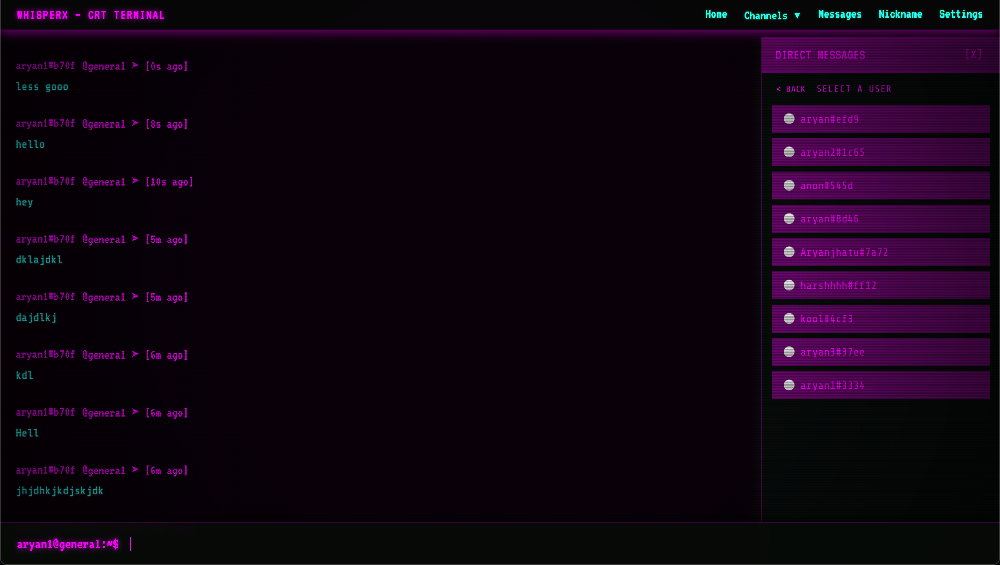
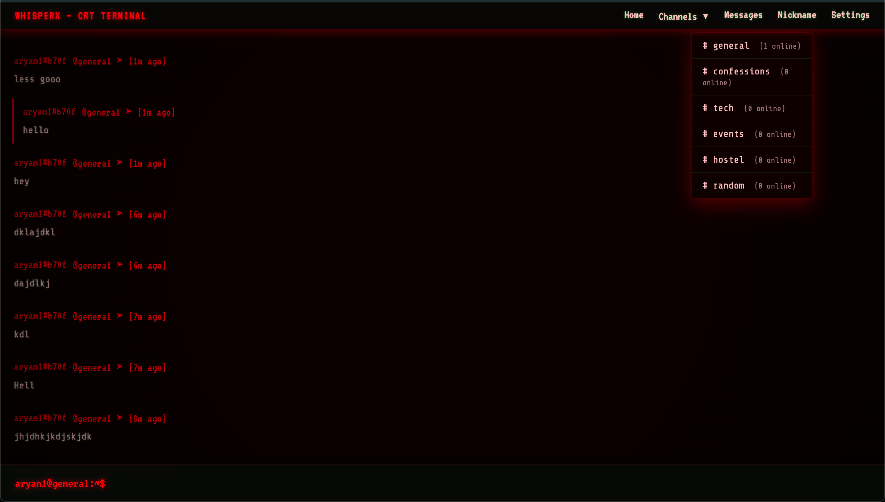
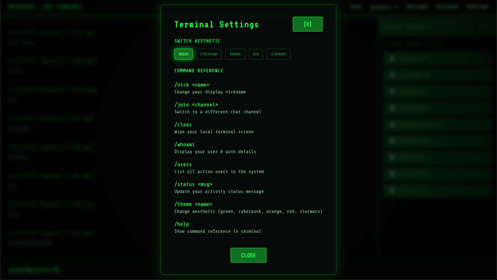

# 📟 WhisperX — CRT Terminal Chat

WhisperX is a high-immersion, real-time messaging platform designed with a retro-futuristic CRT terminal aesthetic. It combines the nostalgia of 80s command-line interfaces with modern real-time capabilities powered by **Supabase**.


---

## ✨ Key Features

- **Authentic CRT Aesthetic**: Complete with scanlines, screen curvature, vignette, and subtle phosphor flickering.
- **Dynamic Theming Engine**: Switch between multiple aesthetics instantly via Settings or `/theme` command.
- **Synthetic Audio Engine**: Low-latency mechanical keyboard sounds and notification blips generated via Web Audio API.
- **Always-Active Input**: Advanced focus management keeps the terminal ready to type at all times.
- **Clean Terminal Feed**: Modern, spacious layout without distracting block backgrounds.
- **Real-time Global Feed**: Instant message delivery across all users using Supabase Realtime.
- **Direct Messaging (DM)**: Private, encrypted-style communication with integrated sound feedback.
- **Presence Tracking**: Live online status indicators and active channel counts.

---

## 🎨 Aesthetic Showcase

| Main Dashboard (Purple) | Direct Messaging |
| :---: | :---: |
|  |  |

| Red Tactical Theme | Settings & Commands |
| :---: | :---: |
|  |  |

---

## ⌨️ Command Reference

WhisperX is built to be used from the keyboard. Type `/help` in the terminal to see available commands:

| Command | Description |
| :--- | :--- |
| `/nick <name>` | Change your display nickname |
| `/join <channel>` | Switch to a different chat channel |
| `/theme <name>` | Switch aesthetics (green, cyberpunk, orange, red, starwars) |
| `/status <msg>` | Set a custom activity status message |
| `/clear` | Wipe your local terminal screen |
| `/whoami` | Display your user ID and auth details |
| `/users` | List all active users currently online |

---

## 🛠️ Tech Stack

- **Frontend**: [React](https://reactjs.org/) + [Vite](https://vitejs.dev/)
- **Styling**: Vanilla CSS (Themeable Variables)
- **State Management**: [Zustand](https://github.com/pmndrs/zustand)
- **Backend**: [Supabase](https://supabase.com/) (Auth, Database, Realtime)
- **Audio**: Web Audio API (Custom Synthesis)

---

## 🚀 Getting Started

1. **Clone & Install**
   ```bash
   git clone https://github.com/yourusername/whisperx.git
   cd whisperx
   npm install
   ```

2. **Environment Setup**
   Add your Supabase credentials to a `.env` file:
   ```env
   VITE_SUPABASE_URL=your_supabase_url
   VITE_SUPABASE_ANON_KEY=your_supabase_anon_key
   ```

3. **Launch**
   ```bash
   npm run dev
   ```

---

## 🗺️ Future Roadmap

WhisperX is an evolving platform. Upcoming features include:

- **🔐 Encrypted Whispers**: Implementing E2EE for all Direct Messages.
- **📂 Terminal File Transfer**: Send binary files as base64-encoded "data whispers."
- **🤖 Bot Protocol**: Native support for terminal-based automation bots.
- **📱 Mobile Communicator**: A dedicated responsive UI designed like a retro handheld device.
- **📡 Matrix Bridge**: Connecting WhisperX to the global Matrix messaging network.

---

<p align="center">
  <i>Developed with ❤️ by <a href="https://github.com/aryan8739">Aryan Rastogi</a></i>
</p>
